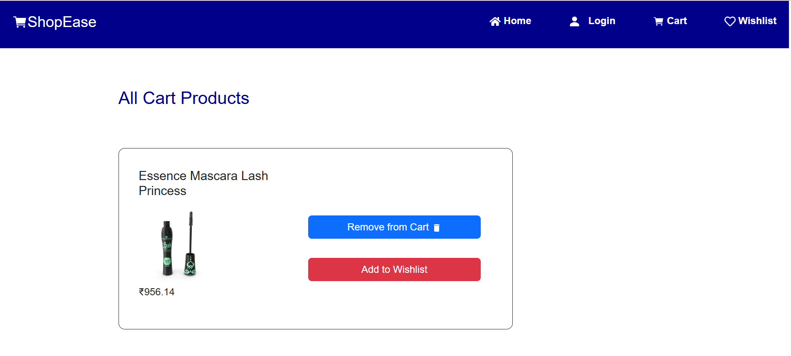
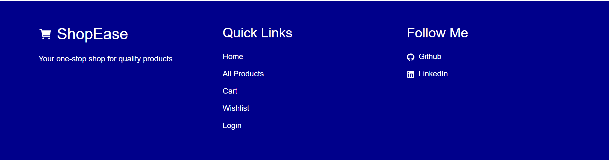
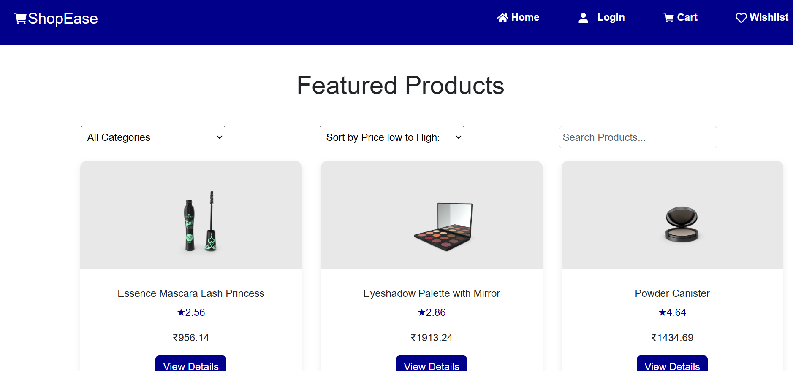
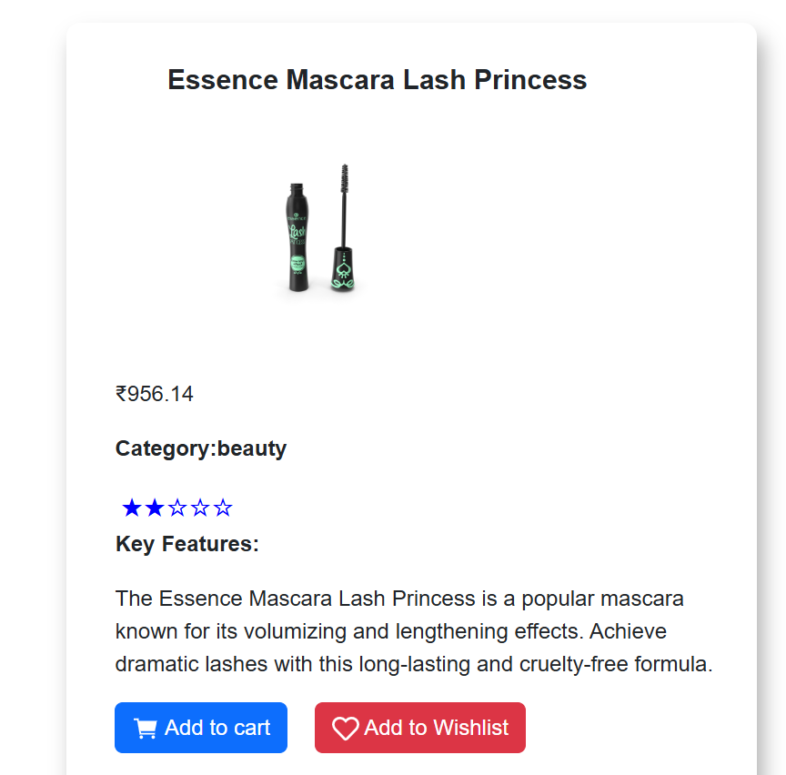

# ShopEase - E-Commerce Application

## Overview

ShopEase is a modern and responsive e-commerce application built with React.js. The application provides users with a seamless shopping experience, allowing them to browse products, search and filter items, manage their cart and wishlist, and view detailed product information.

The project focuses on creating a clean user interface, improving user experience, and implementing real-world frontend development features.

## Features

### Product Management

- Browse products fetched from an external API
- View detailed product information
- Dynamic product rendering

### Search and Filtering

- Search products by keyword
- Filter products by category
- Easy product discovery experience

### Shopping Cart

- Add products to cart
- Remove products from cart
- Update product quantities
- Persistent cart data using Local Storage

### Wishlist

- Add products to wishlist
- Remove products from wishlist
- Persistent wishlist data using Local Storage

### User Experience Enhancements

- Loading skeletons while fetching data
- Toast notifications for user actions
- Responsive design for mobile, tablet, and desktop devices
- Smooth animations and transitions
- Clean and intuitive user interface

### Navigation & Routing

- React Router implementation
- Product Details page
- Custom 404 Error Page for invalid routes
- Responsive navigation bar and footer

## Technologies Used

- React.js
- JavaScript (ES6+)
- HTML5
- CSS3
- React Router
- REST API Integration
- Local Storage
- React Toastify

## Key Frontend Challenges Solved

### Loading State Management

Implemented skeleton loaders to improve the user experience while waiting for API responses.

### Data Persistence

Used Local Storage to persist:

- Login status
- Shopping cart items
- Wishlist items

### API Integration

Integrated REST APIs to fetch and display dynamic product data.

### State Management

Managed product, cart, and wishlist data efficiently across the application.

### Error Handling

Created a custom 404 page to handle undefined routes gracefully.

### Responsive Design

Ensured the application works seamlessly across different screen sizes and devices.

## Learning Outcomes

Through this project, I gained hands-on experience in:

- Building scalable React applications
- API integration and data handling
- Client-side routing
- Local Storage management
- Responsive web development
- Component reusability
- Performance optimization
- User experience improvements

## Screenshots

### Cart Page

## Live Demo

https://e-commerce-project-ec1o.vercel.app/

## GitHub Repository

https://github.com/Shreejad123/E-COMMERCE-PROJECT

## Future Improvements

- User Authentication
- Payment Gateway Integration
- Product Reviews and Ratings
- Order Management
- Admin Dashboard
- Pagination and Infinite Scrolling

## Author

Shreeja D Kotian

Frontend Developer | React.js | JavaScript | HTML | CSS
